---
## Front matter
lang: ru-RU
title: Отчёт по выполнению лабораторной работы №1
subtitle: Установка и настройка Fedora Sway
author:
  - Лисовская Арина Валерьевна
  - Российский университет дружбы народов, Москва, Россия
   
date: 02. марта 2024

## i18n babel
babel-lang: russian
babel-otherlangs: english

## Formatting pdf
toc: false
toc-title: Содержание
slide_level: 2
aspectratio: 169
section-titles: true
theme: metropolis
header-includes:
 - \metroset{progressbar=frametitle,sectionpage=progressbar,numbering=fraction}
 - '\makeatletter'
 - '\beamer@ignorenonframefalse'
 - '\makeatother'
 
## Fonts
mainfont: PT Serif
romanfont: PT Serif
sansfont: PT Sans
monofont: PT Mono
mainfontoptions: Ligatures=TeX
romanfontoptions: Ligatures=TeX
sansfontoptions: Ligatures=TeX,Scale=MatchLowercase
monofontoptions: Scale=MatchLowercase,Scale=0.9
---

# Информация

## Докладчик

:::::::::::::: {.columns align=center}
::: {.column width="70%"}

  * Лисовская Арина Валерьевна
  * Студент
  * Российский университет дружбы народов
  * [1132231434@pfur.ru](mailto:1132231334@pfur.ru)

:::
::: {.column width="30%"}

:::
::::::::::::::

# Вводная часть

## Цель

Приобретение навыков по установке ОС и сервисов, необходимых для работы с ней.
## Задание

Установка операционной системы 
Установка драйверов для VirtualBox 
Настройка раскладки клавиатуры 
Установка имени пользователя и названия хоста 
Подключение общей папки 
Установка программного обеспечения для создания документации 
Домашнее задание

## Установка Fedora Sway

Установила VirtualBOX, устанавливаю Fedora Sway и зададим базовые настройки. (рис. [-@fig:001])

## Установка Fedora Sway

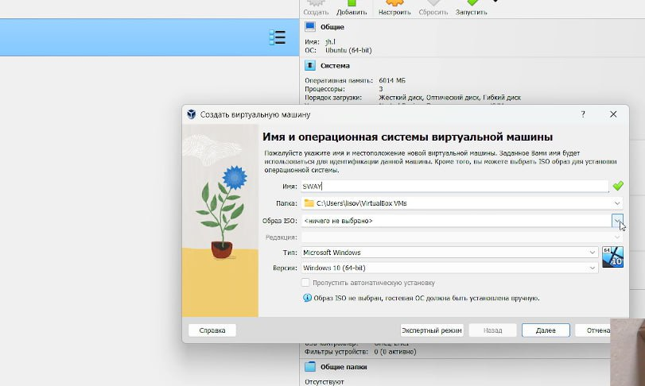{#fig:001 width=70%} 

## Установка Fedora Sway

Запускаем машину и устанавливаем ОС. Выбираем язык, регистрируем и создаем пароли. (рис. [-@fig:002])

## Установка Fedora Sway

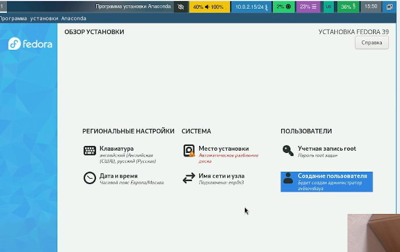{#fig:002 width=70%}

## Установка Fedora Sway

Перезапускаем систему, включаем автообновление и загружаем tmux.(рис. [-@fig:003])

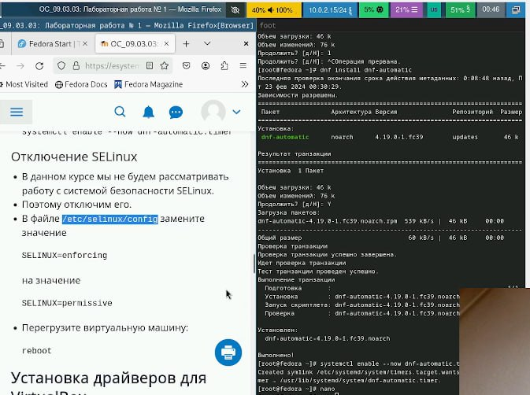{#fig:003 width=70%}

## Установка Fedora Sway

Отключаем SELinux (рис. [-@fig:004])

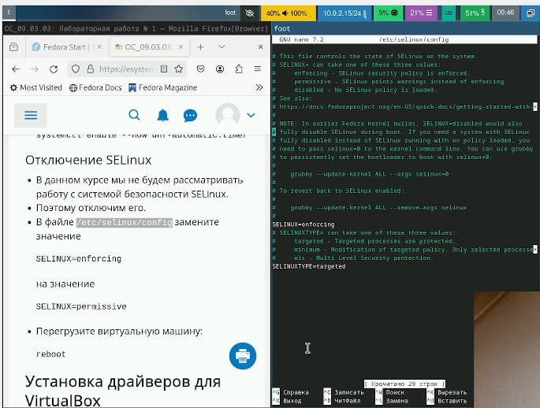{#fig:004 width=70%}

## Установка Fedora Sway

Устанавливаем и обновляем драйвера, установив средства разработки dkms и подмонтируем дикс (рис. [-@fig:005])

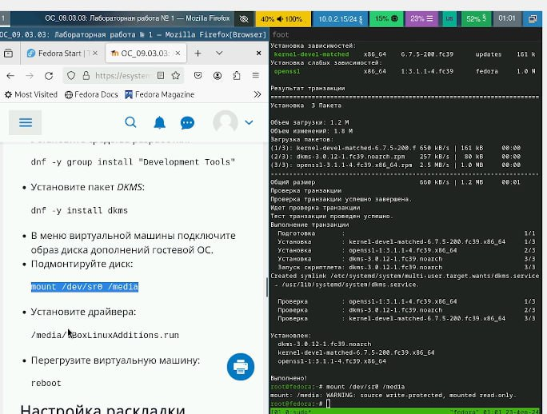{#fig:005 width=70%}
Отредактировав нужные файлы, меняем настройки клавиатуры (рис. [-@fig:006])

## Переход в режим суперпользователя

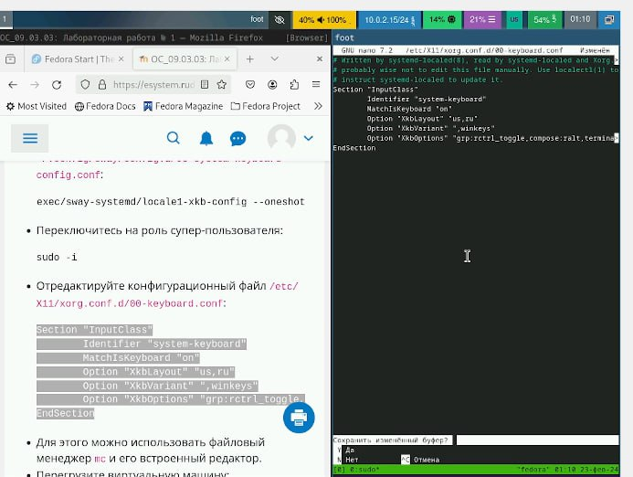{#fig:006 width=70%}

При установке машины имя пользователя было задано верно, а имя холста нет, следовательно меняем его (рис. [-@fig:007])

## Обновление всех пакетов

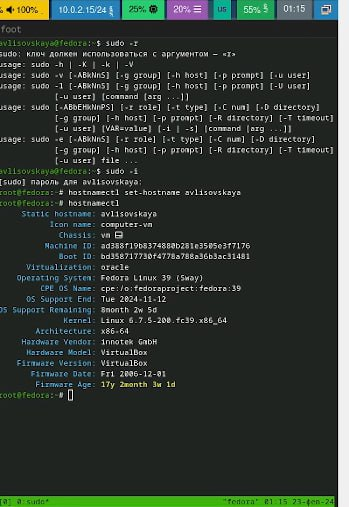{#fig:007 width=70%}
Подключаем общую папку (рис. [-@fig:008])

## Повышение комфорта работы

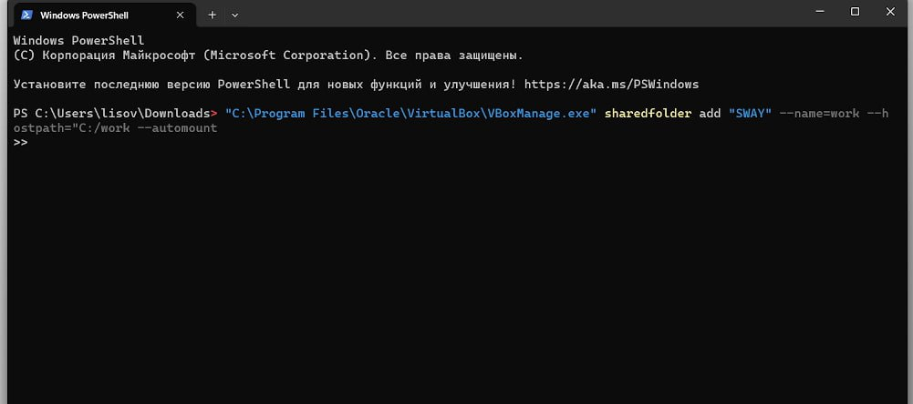{#fig:008 width=70%}

## Установка программного обеспечения для создания документации

Устанавливаем Markdown and texlive (рис. [-@fig:009]) (рис. [-@fig:010])

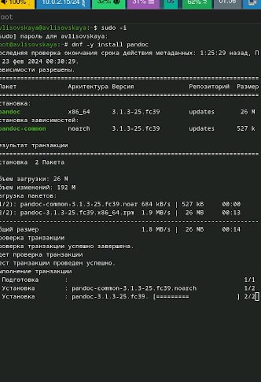{#fig:009 width=70%}
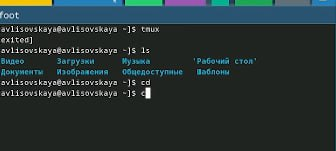{#fig:0010 width=70%}

## Домашняя работа

Следует получить сдедующую информацию: (рис. [-@fig:011])
    Версия ядра Linux (Linux version).
    Частота процессора (Detected Mhz processor).
    Модель процессора (CPU0).
    Объём доступной оперативной памяти (Memory available).
    Тип обнаруженного гипервизора (Hypervisor detected).
    Тип файловой системы корневого раздела.
    Последовательность монтирования файловых систем.

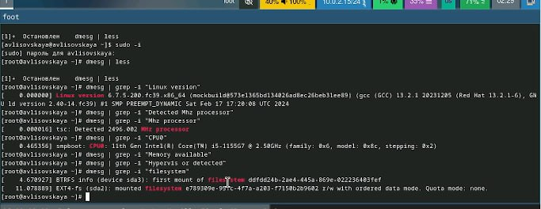{#fig:0011 width=70%}

## Вывод
В ходе работы была установлена  fedora sway на виртуальную машину, были приобретены навыки по ее установке и работе с ней.

