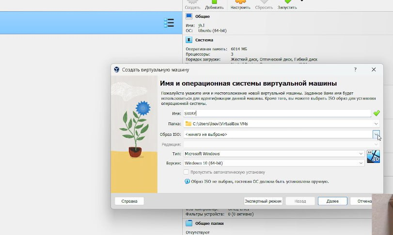
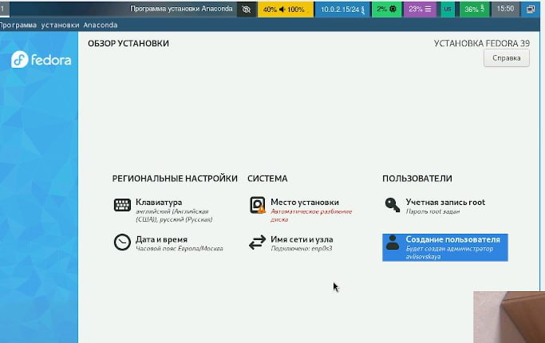
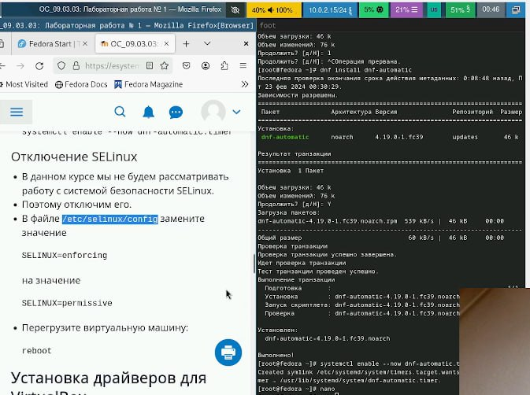
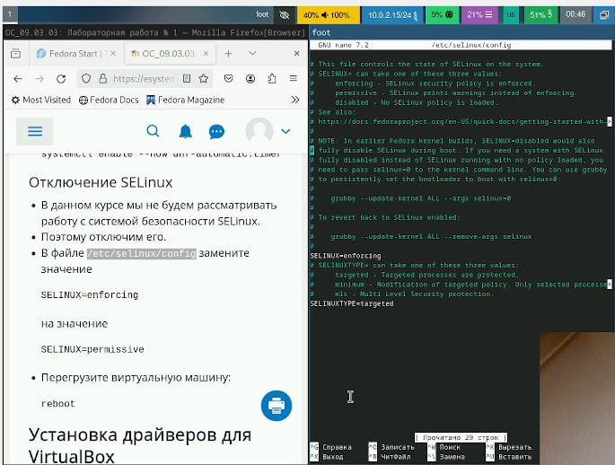
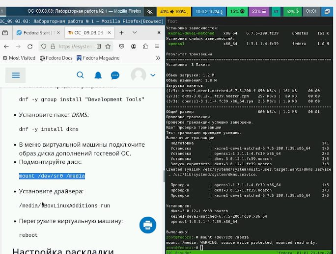
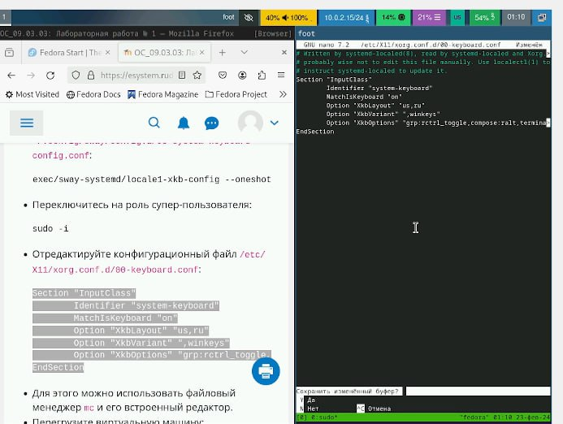
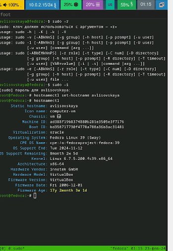
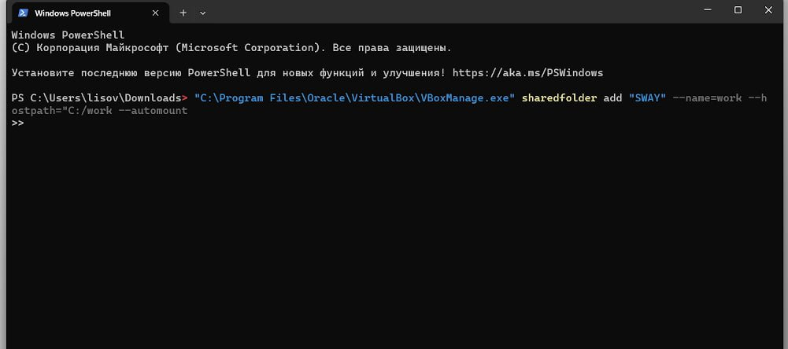
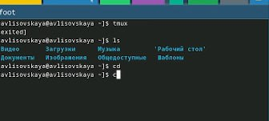
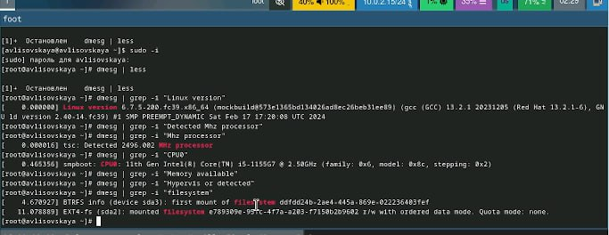

---
## Front matter
title: ""
subtitle: "Лабораторная Работа 1"
author: "Лисовская Арина Валерьевна"

## Generic otions
lang: ru-RU
toc-title: "Содержание"

## Bibliography
bibliography: bib/cite.bib
csl: pandoc/csl/gost-r-7-0-5-2008-numeric.csl

## Pdf output format
toc: true # Table of contents
toc-depth: 2
lof: true # List of figures
lot: true # List of tables
fontsize: 12pt
linestretch: 1.5
papersize: a4
documentclass: scrreprt
## I18n polyglossia
polyglossia-lang:
  name: russian
  options:
	- spelling=modern
	- babelshorthands=true
polyglossia-otherlangs:
  name: english
## I18n babel
babel-lang: russian
babel-otherlangs: english
## Fonts
mainfont: PT Serif
romanfont: PT Serif
sansfont: PT Sans
monofont: PT Mono
mainfontoptions: Ligatures=TeX
romanfontoptions: Ligatures=TeX
sansfontoptions: Ligatures=TeX,Scale=MatchLowercase
monofontoptions: Scale=MatchLowercase,Scale=0.9
## Biblatex
biblatex: true
biblio-style: "gost-numeric"
biblatexoptions:
  - parentracker=true
  - backend=biber
  - hyperref=auto
  - language=auto
  - autolang=other*
  - citestyle=gost-numeric
## Pandoc-crossref LaTeX customization
figureTitle: "Рис."
tableTitle: "Таблица"
listingTitle: "Листинг"
lofTitle: "Список иллюстраций"
lotTitle: "Список таблиц"
lolTitle: "Листинги"
## Misc options
indent: true
header-includes:
  - \usepackage{indentfirst}
  - \usepackage{float} # keep figures where there are in the text
  - \floatplacement{figure}{H} # keep figures where there are in the text
---

# Цель работы
Приобретение навыков по установке ОС и сервисов, необходимых для работы с ней.

# Выполнение лабораторной работы
Установила VirtualBOX, устанавливаю Fedora Sway и зададим базовые настройки.
{#fig:001 width=70%}
Запускаем машину и устанавливаем ОС. Выбираем язык, регистрируем и создаем пароли.
{#fig:002 width=70%}
Перезапускаем систему, включаем автообновление и загружаем tmux.
{#fig:003 width=70%}
Отключаем SELinux
{#fig:004 width=70%}
Устанавливаем и обновляем драйвера, установив средства разработки dkms и подмонтируем дикс
{#fig:005 width=70%}
Отредактировав нужные файлы, меняем настройки клавиатуры
{#fig:006 width=70%}
При установке машины имя пользователя было задано верно, а имя холста нет, следовательно меняем его
{#fig:007 width=70%}
Подключаем общую папку 
{#fig:008 width=70%}
Устанавливаем Markdown and texlive
![Markdown(image/20240229msg857167450-193958.jpg){#fig:009 width=70%}
{#fig:0010 width=70%}
# Домашнее задание 
Следует получить сдедующую информацию:
    Версия ядра Linux (Linux version).
    Частота процессора (Detected Mhz processor).
    Модель процессора (CPU0).
    Объём доступной оперативной памяти (Memory available).
    Тип обнаруженного гипервизора (Hypervisor detected).
    Тип файловой системы корневого раздела.
    Последовательность монтирования файловых систем.

{#fig:0011 width=70%}
# Выводы

В ходе работы была установлена  fedora sway на виртуальную машину, были приобретены навыки по ее установке и работе с ней.

# Список литературы{.unnumbered}

::: {#refs}
:::
