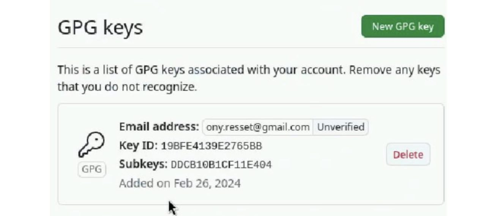

---
## Front matter
lang: ru-RU
title: Лабораторная работа №2
subtitle: Презентация
author:
  - Лисовская Арина Валерьевна 
institute:
  - Российский университет дружбы народов, Москва, Россия
date: 01.03.2024

## i18n babel
babel-lang: russian
babel-otherlangs: english

## Formatting pdf
toc: false
toc-title: Содержание
slide_level: 2
aspectratio: 169
section-titles: true
theme: metropolis
header-includes:
 - \metroset{progressbar=frametitle,sectionpage=progressbar,numbering=fraction}
 - '\makeatletter'
 - '\beamer@ignorenonframefalse'
 - '\makeatother'
 
## Fonts
mainfont: PT Serif
romanfont: PT Serif
sansfont: PT Sans
monofont: PT Mono
mainfontoptions: Ligatures=TeX
romanfontoptions: Ligatures=TeX
sansfontoptions: Ligatures=TeX,Scale=MatchLowercase
monofontoptions: Scale=MatchLowercase,Scale=0.9

---

# Информация

## Докладчик

:::::::::::::: {.columns align=center}
::: {.column width="70%"}

  * Лисовская Арина Валерьевна 
  * студент
  * Российский университет дружбы народов
  * [1132231434@pfur.ru](mailto:1132231434@pfur.ru)

:::
::: {.column width="30%"}

:::
::::::::::::::

## Цель

Изучить идеологию и применение средств контроля версий.
Освоить умения по работе с git

## Задачи

Создать базовую конфигурацию для работы с git.
Создать ключ SSH.
Создать ключ PGP.
Настроить подписи git.
Зарегистрироваться на Github.
Создать локальный каталог для выполнения заданий по предмету

# Вводная часть

## Устанавливаем git and fn

Устанавливаем git and fn

{#fig:001 width=70%}

## Базовые настройки git

Задаем имя и email владельца репозитория, настраиваем utf-8 и параметры autocrlj and saleclrf

{#fig:002 width=70%}

{#fig:003 width=70%}

## Создание ключа shh и pgp

Создаем ключ shh u pgp

{#fig:004 width=70%}

## Создание ключа shh и pgp

Авторизуремся на GitHub и добавим созданные ключи, скопировав их отпечатки

{#fig:005 width=70%}

## Создание ключа shh и pgp

Настройка автоматической подписи коммитов

{#fig:006 width=70%}

## Создание ключа shh и pgp

Авторизуемся с помощью команды gn login auth и создав и перейдя в нужные  каталоги создадим репозиторий но основе шаблона, а затем клонируем его себе

{#fig:007 width=70%}

## Создание ключа shh и pgp

Далее удаляем все лишние файлы и создаем необходимые каталоги

{#fig:008 width=70%}

## Настройка каталога курса

Отправляем все изменения на github

{#fig:009 width=70%}

## Вывод

Была произведена установка git, проведена его первоначальная настройка, были созданы ключи для авторизации и подписи, а также создан репозиторий курса из предложенного шаблона

