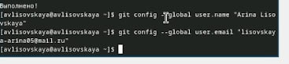
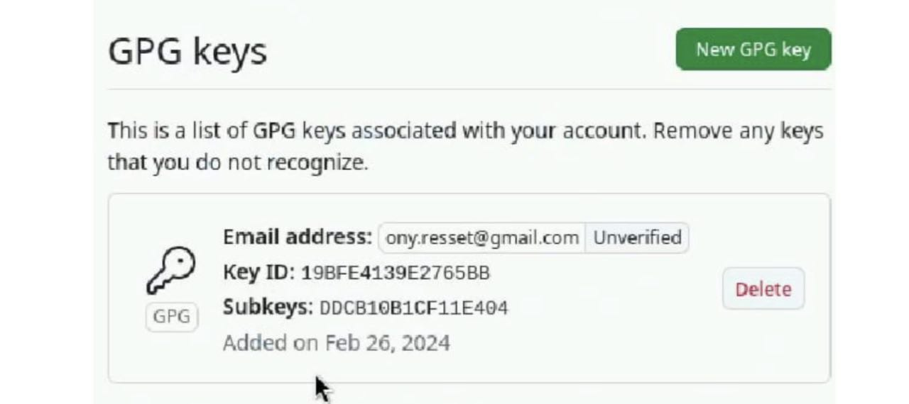
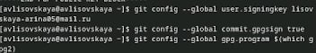
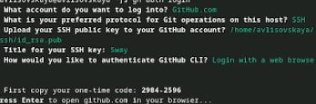
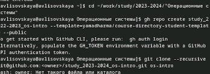

---
## Front matter
title: ""
subtitle: "Лабораторная работа 2"
author: "Лисовская Арина Валерьевна"

## Generic otions
lang: ru-RU
toc-title: "Содержание"

## Bibliography
bibliography: bib/cite.bib
csl: pandoc/csl/gost-r-7-0-5-2008-numeric.csl

## Pdf output format
toc: true # Table of contents
toc-depth: 2
lof: true # List of figures
lot: true # List of tables
fontsize: 12pt
linestretch: 1.5
papersize: a4
documentclass: scrreprt
## I18n polyglossia
polyglossia-lang:
  name: russian
  options:
	- spelling=modern
	- babelshorthands=true
polyglossia-otherlangs:
  name: english
## I18n babel
babel-lang: russian
babel-otherlangs: english
## Fonts
mainfont: PT Serif
romanfont: PT Serif
sansfont: PT Sans
monofont: PT Mono
mainfontoptions: Ligatures=TeX
romanfontoptions: Ligatures=TeX
sansfontoptions: Ligatures=TeX,Scale=MatchLowercase
monofontoptions: Scale=MatchLowercase,Scale=0.9
## Biblatex
biblatex: true
biblio-style: "gost-numeric"
biblatexoptions:
  - parentracker=true
  - backend=biber
  - hyperref=auto
  - language=auto
  - autolang=other*
  - citestyle=gost-numeric
## Pandoc-crossref LaTeX customization
figureTitle: "Рис."
tableTitle: "Таблица"
listingTitle: "Листинг"
lofTitle: "Список иллюстраций"
lotTitle: "Список таблиц"
lolTitle: "Листинги"
## Misc options
indent: true
header-includes:
  - \usepackage{indentfirst}
  - \usepackage{float} # keep figures where there are in the text
  - \floatplacement{figure}{H} # keep figures where there are in the text
---

# Цель работы

Изучение работы и назначение системы контроля версий git приобретение навыков по работе с ней

# Выполнение лабораторной работы
Устанавливаем git and fn
{#fig:001 width=70%}

Задаем имя и email владельца репозитория, настраиваем utf-8 и параметры autocrlj and saleclrf
{#fig:002 width=70%}
{#fig:003 width=70%}

Создаем ключ shh u pgp
{#fig:004 width=70%}

Авторизуремся на GitHub и добавим созданные ключи, скопировав их отпечатки
{#fig:005 width=70%}
Настройка автоматической подписи коммитов
{#fig:006 width=70%}

Авторизуемся с помощью команды gn login auth и создав и перейдя в нужные  каталоги создадим репозиторий но основе шаблона, а затем клонируем его себе
{#fig:007 width=70%}
Далее удаляем все лишние файлы и создаем необходимые каталоги
{#fig:008 width=70%}

Отправляем все изменения на github
{#fig:009 width=70%}
#Контрольные выпросы 

    Что такое системы контроля версий (VCS) и для решения каких задач они предназначаются?
    Объясните следующие понятия VCS и их отношения: хранилище, commit, история, рабочая копия.
    Что представляют собой и чем отличаются централизованные и децентрализованные VCS? Приведите примеры VCS каждого вида.
    Опишите действия с VCS при единоличной работе с хранилищем.
    Опишите порядок работы с общим хранилищем VCS.
    Каковы основные задачи, решаемые инструментальным средством git?
    Назовите и дайте краткую характеристику командам git.
    Приведите примеры использования при работе с локальным и удалённым репозиториями.
    Что такое и зачем могут быть нужны ветви (branches)?
    Как и зачем можно игнорировать некоторые файлы при commit?

# Выводы
В ходе работы была освоена работа с системой контроля версий, был установлен git, проведена авторизация, заданы базовые настройки, создались ключи, клонирование репозиторий и тд.
# Список литературы{.unnumbered}

::: {#refs}
:::
