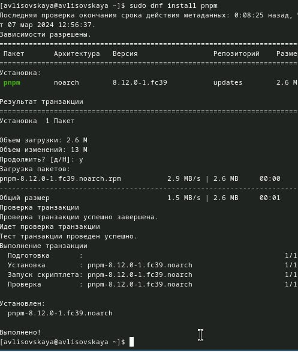
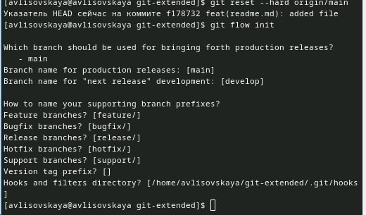

---
## Front matter
lang: ru-RU
title: Лабораторная работа №2
subtitle: Презентация
author:
  - Лисовская Арина Валерьевна 
institute:
  - Российский университет дружбы народов, Москва, Россия
date: 01.03.2024

## i18n babel
babel-lang: russian
babel-otherlangs: english

## Formatting pdf
toc: false
toc-title: Содержание
slide_level: 2
aspectratio: 169
section-titles: true
theme: metropolis
header-includes:
 - \metroset{progressbar=frametitle,sectionpage=progressbar,numbering=fraction}
 - '\makeatletter'
 - '\beamer@ignorenonframefalse'
 - '\makeatother'
 
## Fonts
mainfont: PT Serif
romanfont: PT Serif
sansfont: PT Sans
monofont: PT Mono
mainfontoptions: Ligatures=TeX
romanfontoptions: Ligatures=TeX
sansfontoptions: Ligatures=TeX,Scale=MatchLowercase
monofontoptions: Scale=MatchLowercase,Scale=0.9

---

# Информация

## Докладчик

:::::::::::::: {.columns align=center}
::: {.column width="70%"}

  * Лисовская Арина Валерьевна 
  * студент
  * Российский университет дружбы народов
  * [1132231434@pfur.ru](mailto:1132231434@pfur.ru)

:::
::: {.column width="30%"}

:::
::::::::::::::

## Цель

Изучить идеологию и применение средств контроля версий.
Освоить умения по работе с git

# Вводная часть

## Установка git-flow

Установка git-flow

{#fig:001 width=70%}

## Базовые настройки git

добавим каталог с исполняемыми файлами, устанавливаемыми yarn, в переменную PATH (рис. [-@fig:002]).

.jpg){#fig:002 width=70%}

создаем репозиторий на GitHub. Для примера назовём его git-extended.
Делаем первый коммит и выкладываем на github (рис. [-@fig:003])

{#fig:003 width=70%}

заполняем несколько параметров пакета (рис. [-@fig:004])

{#fig:004 width=70%}

## Формат коммитов

Сконфигурим формат коммитов. Для этого добавим в файл package.json команду для формирования коммитов (рис. [-@fig:005])

{#fig:005 width=70%}

Конфигурация git-flow (рис. [-@fig:006])

{#fig:006 width=70%}

Создадим релиз с версией 1.2.3 (рис. [-@fig:007])

{#fig:007 width=70%}

Зальём релизную ветку в основную ветку (рис. [-@fig:008])

{#fig:008 width=70%}

Отправим данные на github (рис. [-@fig:009])

{#fig:009 width=70%}

## Вывод

Я научилась создавать и работать с репозиторием

