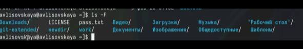
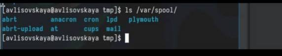
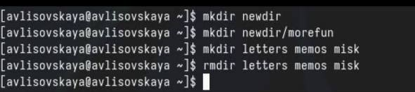

---
## Front matter
lang: ru-RU
title: Лабораторная работа №2
subtitle: Презентация
author:
  - Лисовская Арина Валерьевна 
institute:
  - Российский университет дружбы народов, Москва, Россия
date: 01.03.2024

## i18n babel
babel-lang: russian
babel-otherlangs: english

## Formatting pdf
toc: false
toc-title: Содержание
slide_level: 2
aspectratio: 169
section-titles: true
theme: metropolis
header-includes:
 - \metroset{progressbar=frametitle,sectionpage=progressbar,numbering=fraction}
 - '\makeatletter'
 - '\beamer@ignorenonframefalse'
 - '\makeatother'
 
## Fonts
mainfont: PT Serif
romanfont: PT Serif
sansfont: PT Sans
monofont: PT Mono
mainfontoptions: Ligatures=TeX
romanfontoptions: Ligatures=TeX
sansfontoptions: Ligatures=TeX,Scale=MatchLowercase
monofontoptions: Scale=MatchLowercase,Scale=0.9

---

# Информация

## Докладчик

:::::::::::::: {.columns align=center}
::: {.column width="70%"}

  * Лисовская Арина Валерьевна 
  * студент
  * Российский университет дружбы народов
  * [1132231434@pfur.ru](mailto:1132231434@pfur.ru)

:::
::: {.column width="30%"}

:::
::::::::::::::

## Цель

Приобретение практических навыков взаимодействия пользователя с системой посредством командной строки

## Задачи

1. Определите полное имя вашего домашнего каталога. Далее относительно этого каталога будут выполняться последующие упражнения. 
2. Выполните следующие действия: 
2.1. Перейдите в каталог /tmp. 
2.2. Выведите на экран содержимое каталога /tmp. Для этого используйте команду ls с различными опциями. Поясните разницу в выводимой на экран информации. 
2.3. Определите, есть ли в каталоге /var/spool подкаталог с именем cron? 
2.4. Перейдите в Ваш домашний каталог и выведите на экран его содержимое. Определите, кто является владельцем файлов и подкаталогов?

# Вводная часть

## Определение имени каталога

Для начала посмотрим полный путь для нашего каталога

{#fig:001 width=70%}

## Переход в /tmp

Далее, перейдём в каталог /tmp и просмотрим его содержимое

{#fig:002 width=70%}

## ls

С помощью ключа -a выведем и дополнительные файлы

{#fig:002 width=70%}

## ls

Теперь выведем файлы с полной информацией с помощью ключа -l

{#fig:002 width=70%}

## ls

Теперь выведем типы элементов с помощью -F 

{height=60%}

## Содержимое /var/spool

Посмотрим, есть ли в каталоге /var/spool каталог cron. Как видим, он есть

{#fig:004 width=70%}

## Создание и удаление директорий

создадим каталог newdir. Внутри него создадим каталог morefun. Создадим каталоги letters memos и misk одной коммандой. Попробуем удалить newdir с помощью rm. Не получилось, так как это каталог. Удалим его дочерний элемент с помощью rmdir. Удаление прошло успешно 

{#fig:005 width=70%}

## Вывод

В результате выполнения работы были получены навыки работы с базовыми командами терминала

