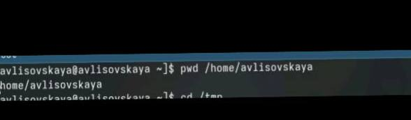
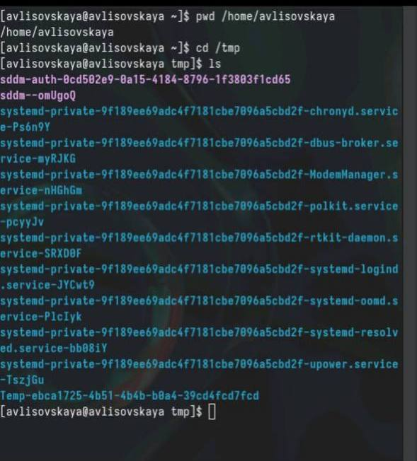
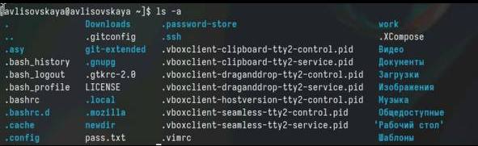
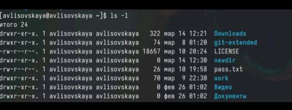
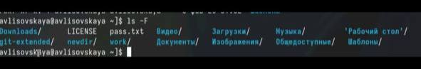
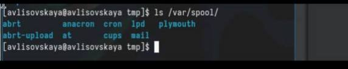
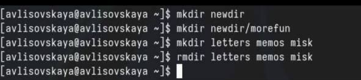

---
## Front matter
title: ""
subtitle: "Лабораторная работа 6"
author: "Лисовская Арина Валерьевна"

## Generic otions
lang: ru-RU
toc-title: "Содержание"

## Bibliography
bibliography: bib/cite.bib
csl: pandoc/csl/gost-r-7-0-5-2008-numeric.csl

## Pdf output format
toc: true # Table of contents
toc-depth: 2
lof: true # List of figures
lot: true # List of tables
fontsize: 12pt
linestretch: 1.5
papersize: a4
documentclass: scrreprt
## I18n polyglossia
polyglossia-lang:
  name: russian
  options:
	- spelling=modern
	- babelshorthands=true
polyglossia-otherlangs:
  name: english
## I18n babel
babel-lang: russian
babel-otherlangs: english
## Fonts
mainfont: PT Serif
romanfont: PT Serif
sansfont: PT Sans
monofont: PT Mono
mainfontoptions: Ligatures=TeX
romanfontoptions: Ligatures=TeX
sansfontoptions: Ligatures=TeX,Scale=MatchLowercase
monofontoptions: Scale=MatchLowercase,Scale=0.9
## Biblatex
biblatex: true
biblio-style: "gost-numeric"
biblatexoptions:
  - parentracker=true
  - backend=biber
  - hyperref=auto
  - language=auto
  - autolang=other*
  - citestyle=gost-numeric
## Pandoc-crossref LaTeX customization
figureTitle: "Рис."
tableTitle: "Таблица"
listingTitle: "Листинг"
lofTitle: "Список иллюстраций"
lotTitle: "Список таблиц"
lolTitle: "Листинги"
## Misc options
indent: true
header-includes:
  - \usepackage{indentfirst}
  - \usepackage{float} # keep figures where there are in the text
  - \floatplacement{figure}{H} # keep figures where there are in the text
---

# Цель работы

Изучение работы и назначение системы контроля версий git приобретение навыков по работе с ней

# Выполнение лабораторной работы
Для начала посмотрим полный путь для нашего каталога 
{#fig:001 width=70%}

Далее, перейдём в каталог /tmp и просмотрим его содержимое
{#fig:002 width=70%}

С помощью ключа -a выведем и дополнительные файлы 
{#fig:004 width=70%}

Теперь выведем файлы с полной информацией с помощью ключа -l

{#fig:005 width=70%}

теперь выведем типы элементов с помощью -F

{#fig:006 width=70%}

Посмотрим, есть ли в каталоге /var/spool каталог cron. Как видим, он есть

{#fig:007 width=70%}

Создадим каталог newdir. Внутри него создадим каталог morefun. Создадим каталоги letters memos и misk одной коммандой. Попробуем удалить newdir с помощью rm. Не получилось, так как это каталог. Удалим его дочерний элемент с помощью rmdir. Удаление прошло успешно 

{#fig:008 width=70%}

#Контрольные выпросы 

    Строка, в которую мы можем писать команды для исполнения
    С помощью pwd. Например: pwd Загрузки
    С помощью ls -F. Например: ls -F /tmp
    С помощью ls -al. Например: ls -al /var
    При помощи rm и rmdir соответственно. С помощью rm -R можно удалить как файл, так и каталог. Например: rm -R git-extended
    С помощью history. Например, history
    !<номер_команды>:s/<что_меняем>/<на_что_меняем>. Например, !3:s/a/F
    cd; mkdir newdir; rm file.txt
    Символы экранирования - специальные символы, которые интерпретируются по другому. Например, !3:s/-a//newdir
    Выводит также владельца, дату, права доступа и название
    Относительный путь - путь относительно текущего нахождения. Например, cd tmp и cd /tmp - разные по значению команды
    С помощью man
    tab

# Выводы
В результате выполнения работы были получены навыки работы с базовыми командами терминала
# Список литературы{.unnumbered}

::: {#refs}
:::
